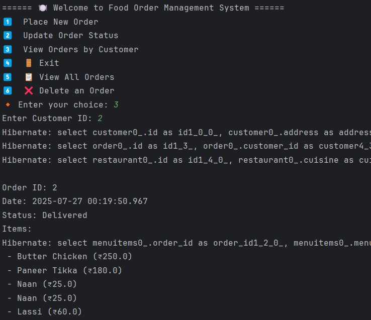
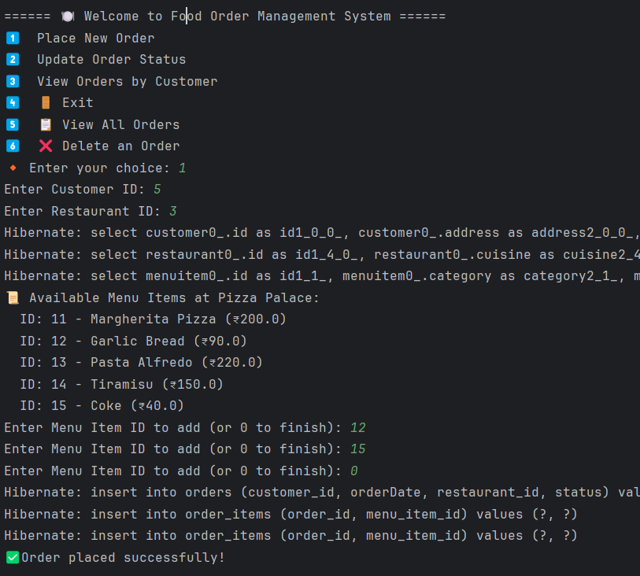

# 🍽️ Food Ordering System (Hibernate + Java)

[](https://www.oracle.com/java/technologies/javase/jdk21-archive-downloads.html)
[](https://hibernate.org)
[](https://www.mysql.com)
[](https://maven.apache.org/)
[](https://www.jetbrains.com/idea/)
[](LICENSE)
[](https://github.com/TeresaFernando/food-ordering-hibernate/commits)
[](https://github.com/TeresaFernando/food-ordering-hibernate)

This is a console-based food ordering application built using **Java**, **Hibernate ORM**, and **MySQL**.  
It allows users to manage customers, restaurants, and menu items, and place orders using a relational database.  
Great for learning Hibernate, object-relational mapping, and Java CRUD operations.

---

## 📌 Features

- 👥 Add Customers, Restaurants, and Menu Items  
- 🛒 Place Orders  
- 🔍 View Orders by Customer  
- 📋 View All Orders  
- 🔄 Update Order Status  
- ❌ Delete Orders    

---

## 🛠️ Technologies Used

- Java  
- Hibernate ORM  
- MySQL  
- Maven  
- IntelliJ IDEA  

---

## 🗂️ Project Structure
```text
├── src/
│   ├── main/
│   │   ├── java/
│   │   │   └── com/foodorder/
│   │   │       ├── AppInsertData.java
│   │   │       ├── FoodOrderApp.java
│   │   │       └── dao/
│   │   │           ├── Customer.java
│   │   │           ├── Restaurant.java
│   │   │           ├── MenuItem.java
│   │   │           └── Order.java
│   │   └── resources/
│   │       └── hibernate.cfg.xml
│   └── test/
│       └── java/
│           └── AppTest.java
├── pom.xml
├── README.md
├── LICENSE
└── screenshots/
    ├── screenshot1.png
    └── screenshot2.png
```

---

## ▶️ How to Run

1. Clone this repository  
2. Open the project in IntelliJ IDEA  
3. Create a MySQL database named `food_order_db`  
4. Update `hibernate.cfg.xml` with your MySQL username, password, and DB details  
5. Run `AppInsertData.java` to populate initial sample data  
6. Run `FoodOrderApp.java` to use the console-based ordering system 

---

## 📸 Screenshots

### 🧭 Main Menu  


### ✅ Placing an Order  


---

## 💻 Sample Console Output

```text
====== 🍽️ Welcome to Food Order Management System ======
1️⃣  Place New Order
2️⃣  Update Order Status
3️⃣  View Orders by Customer
4️⃣  🚪 Exit
5️⃣  📋 View All Orders
6️⃣  ❌ Delete an Order
🔸 Enter your choice: 
```
---

## 🙋‍♀️ Author

**Teresa Fernando**  
*IT Enthusiast | Java Developer | Passionate about learning*

---

## 📜 License

This project is for educational purposes and open to learning and improvement.
